## IterComp: Iterative Composition-Aware Feedback Learning from Model Gallery for Text-to-Image Generation - ICLR 2025

This repository contains the official implementation of our [IterComp](https://arxiv.org/abs/2410.07171) (**ICLR 2025**).

> [**IterComp: Iterative Composition-Aware Feedback Learning from Model Gallery for Text-to-Image Generation**](https://arxiv.org/abs/2410.07171)   
> [Xinchen Zhang\*](https://cominclip.github.io/), 
> [Ling Yang\*](https://yangling0818.github.io/), 
> [Guohao Li](https://ghli.org/), 
> [Yaqi Cai](https://github.com/CCYaqi),
> [Jiake Xie](https://scholar.google.com/citations?hl=zh-CN&user=pD8wUxgAAAAJ),
> [Yong Tang](https://scholar.google.com/citations?user=ubVWrRwAAAAJ&hl=en), 
> [Yujiu Yang](https://sites.google.com/view/iigroup-thu/about), 
> [Mengdi Wang](https://mwang.princeton.edu/), 
> [Bin Cui](https://cuibinpku.github.io/) 
> <br>**Tsinghua University, Peking University, University of Oxford, USTC, LibAI Lab, Princeton University**<br>

<p align="left">
  <a href='https://arxiv.org/abs/2410.07171'>
  </a> 
  <a href='https://huggingface.co/comin/IterComp'>
  </a>
  <a href='https://civitai.com/models/840857/itercomp'>
  </a> 
  <a href="" target='_blank'>
  </a> 
</p>

<details>
    <summary>Click for full abstract</summary>
Advanced diffusion models like RPG, Stable Diffusion 3 and FLUX have made notable strides in compositional text-to-image generation. However, these methods typically exhibit distinct strengths for compositional generation, with some excelling in handling attribute binding and others in spatial relationships. This disparity highlights the need for an approach that can leverage the complementary strengths of various models to comprehensively improve the composition capability. To this end, we introduce IterComp, a novel framework that aggregates composition-aware model preferences from multiple models and employs an iterative feedback learning approach to enhance compositional generation. Specifically, we curate a gallery of six powerful open-source diffusion models and evaluate their three key compositional metrics: attribute binding, spatial relationships, and non-spatial relationships. Based on these metrics, we develop a composition-aware model preference dataset comprising numerous image-rank pairs to train composition-aware reward models. Then, we propose an iterative feedback learning method to enhance compositionality in a closed-loop manner, enabling the progressive self-refinement of both the base diffusion model and reward models over multiple iterations. Theoretical proof demonstrates the effectiveness and extensive experiments show our significant superiority over previous SOTA methods (e.g., Omost and FLUX), particularly in multi-category object composition and complex semantic alignment. IterComp opens new research avenues in reward feedback learning for diffusion models and compositional generation.
</details>

## Introduction

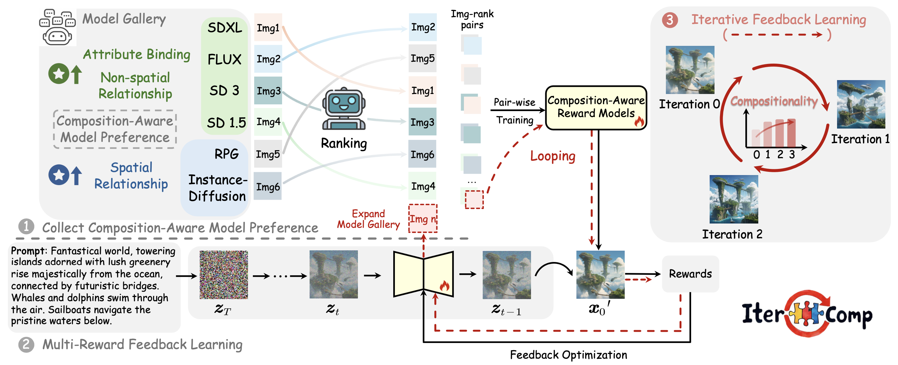

We collect composition-aware model preferences from multiple models and employ an iterative feedback learning approach to enable the progressive self-refinement of both the base diffusion model and reward models.

## New Updates

**[2025.02]** We enhance IterComp-RPG with LLMs that possess the strongest reasoning capabilities, including [**DeepSeek-R1**](https://github.com/deepseek-ai/DeepSeek-R1), [**OpenAI o3-mini**](https://openai.com/index/openai-o3-mini/), and [**OpenAI o1**](https://openai.com/index/learning-to-reason-with-llms/) to achieve outstanding compositional image generation under complex prompts.

**[2025.01]** IterComp is accepted by ICLR 2025!!!

**[2024.10]** Checkpoints of base diffusion model are publicly available on [HuggingFace Repo](https://huggingface.co/comin/IterComp).

**[2024.10]** Our main code of IterComp is released.

## New Changes of IterComp

### 🔥🔥🔥News: Enhance IterComp-RPG with DeepSeek-R1, o3-mini and o1

<details open>
<summary>2048*1024 Examples</summary>
<table class="center" style="width: 100%; border-collapse: collapse;">
<tr>
<td colspan="2" style="border: none; text-align: center;">DeepSeek-R1</td>
</tr>
<tr>
<td colspan="2" style="border: none">
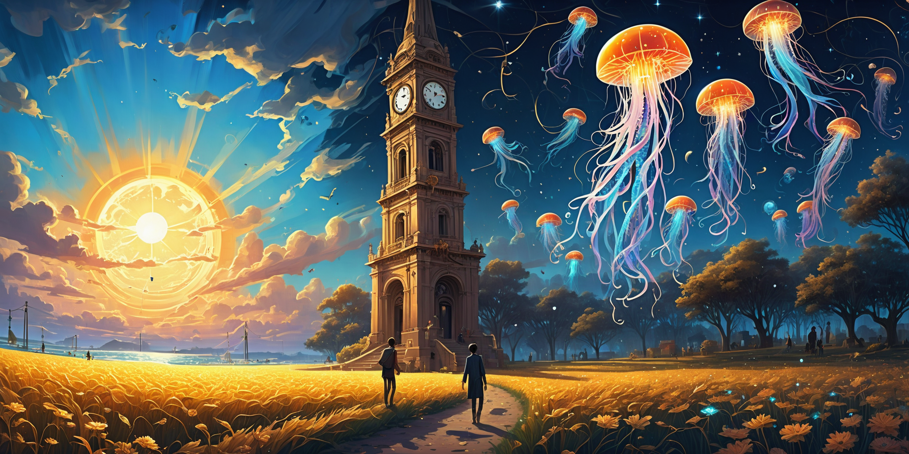
</td>
</tr>
<tr>
<td width="50%" style="border: none; text-align: center;">OpenAI o3-mini</td>
<td width="50%" style="border: none; text-align: center;">OpenAI o1</td>
</tr>
<tr>
<td style="border: none">

</td>
<td style="border: none">
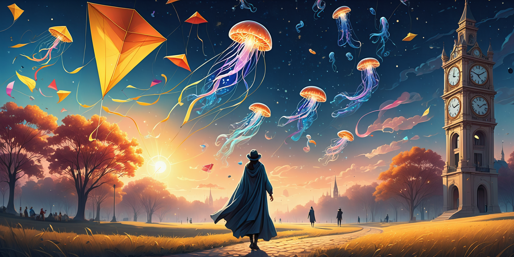
</td>
</tr>
<tr>
<td colspan="2" style="border: none; text-align: left; padding: 10px">
A surreal dreamscape where the sky is split into day and night. On the left side, a bright sun shines over golden fields with people flying kites, while on the right side, a deep blue night sky is filled with stars and glowing jellyfish floating in the air. In the center, a giant clock tower stands, with its hands pointing to different times for each side. A person wearing a half-day, half-night cloak is walking down the path that separates the two worlds.
</td>
</tr>
</table>
</details>

<details open>
<summary>1024*1024 Examples</summary> 
<table class="center" style="width: 100%; border-collapse: collapse;">
  <tr>
    <td width="33%" style="border: none; text-align: center; word-wrap: break-word">DeepSeek-R1</td>
    <td width="33%" style="border: none; text-align: center; word-wrap: break-word">OpenAI o3-mini</td>
    <td width="33%" style="border: none; text-align: center; word-wrap: break-word">OpenAI o1</td>
  </tr>
  <tr>
    <td width="33%" style="border: none">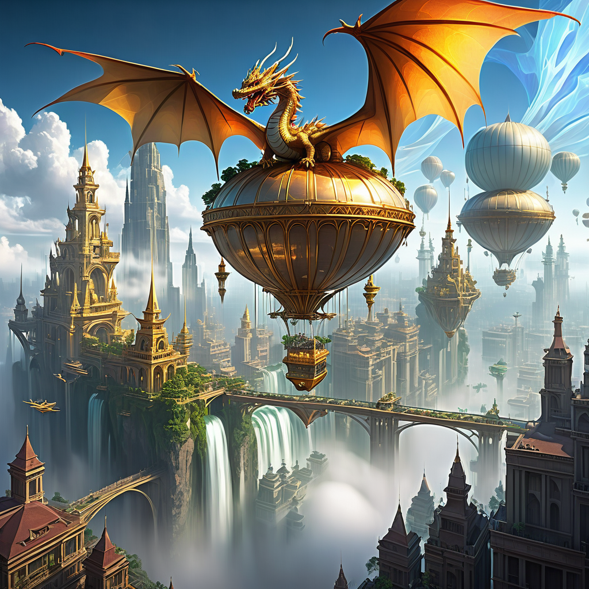</td>
    <td width="33%" style="border: none">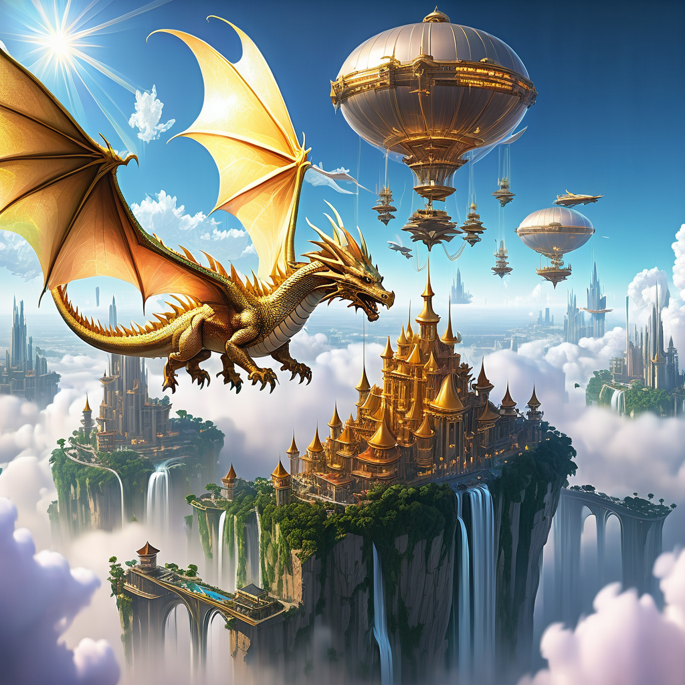</td>
    <td width="33%" style="border: none">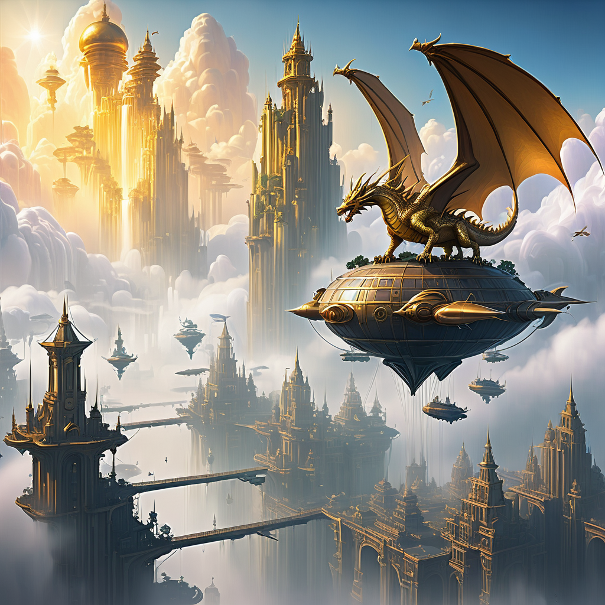</td>
  </tr>
  <tr>
    <td colspan="3" style="border: none; text-align: left; word-wrap: break-word">
      A floating city above the clouds, with golden towers and waterfalls cascading into the mist below. A dragon with shimmering wings soars through the sky, while airships dock at crystal platforms.
    </td>
  </tr>
  <tr>
    <td width="33%" style="border: none"></td>
    <td width="33%" style="border: none"></td>
    <td width="33%" style="border: none"></td>
  </tr>
  <tr>
    <td colspan="3" style="border: none; text-align: left; word-wrap: break-word">
      A cozy winter cabin in a snowy forest at night. Warm yellow lights glow from the windows, and smoke gently rises from the chimney. A deer stands near the trees, watching as a child builds a snowman. In the sky, the northern lights shimmer above the treetops.
    </td>
  </tr>
</table>
</details>


We recommend using [**DeepSeek-R1**](https://github.com/deepseek-ai/DeepSeek-R1) as the regional planner and [**IterComp**](https://github.com/YangLing0818/IterComp) as the base diffusion model to achieve the state-of-the-art compositional text-to-image generation results.


## Visual Display

### 1. Complex Compositional Generation

<details open>
<summary>1024*1024 Examples</summary> 
<table class="center">
    <tr>
    <td width=50% style="border: none">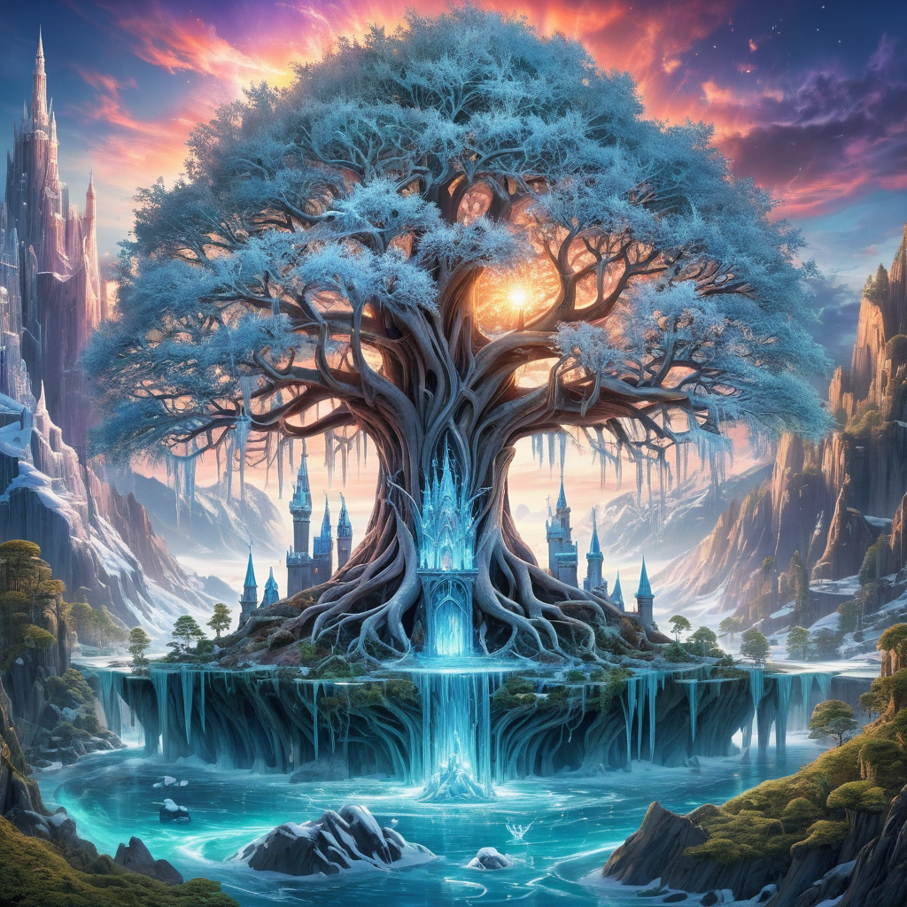</td>
    <td width=50% style="border: none">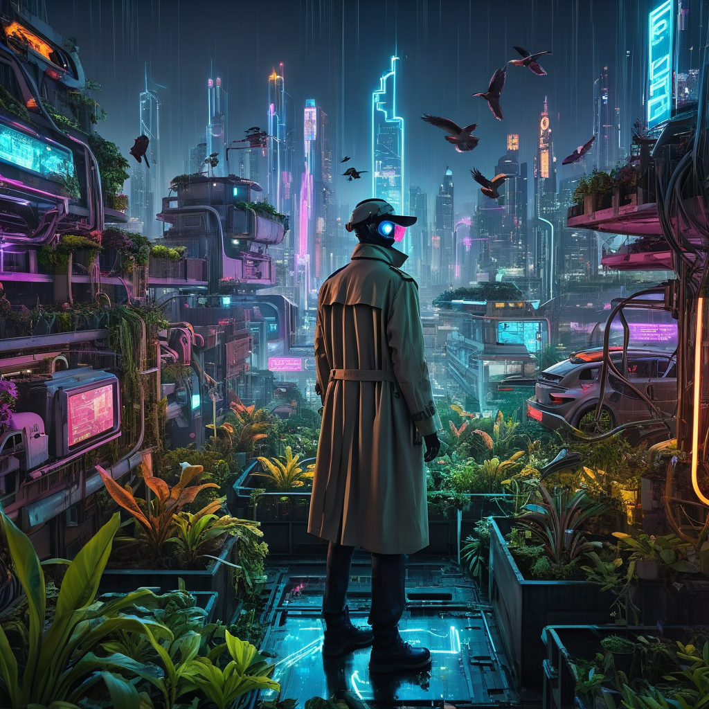</td>
  <tr>
    <td width="50%" style="border: none; text-align: left; word-wrap: break-word">A colossal, ancient tree with leaves made of ice towers over a mystical castle. Green trees line both sides, while cascading waterfalls and an ethereal glow adorn the scene. The backdrop features towering mountains and a vibrant, colorful sky.</td>
    <td width="50%" style="border: none; text-align: left; word-wrap: break-word">On the rooftop of a skyscraper in a bustling cyberpunk city, a figure in a trench coat and neon-lit visor stands amidst a garden of bio-luminescent plants, overlooking the maze of flying cars and towering holograms. Robotic birds flit among the foliage, digital billboards flash advertisements in the distance.</td>
    </tr>
</table>
</details>

<details open>
<summary>1024*1024 Examples</summary> 
<table class="center">
    <tr>
    <td width=50% style="border: none"></td>
    <td width=50% style="border: none"></td>
  <tr>
    <td width="50%" style="border: none; text-align: left; word-wrap: break-word">In a magical seascape, a majestic ship sails through crystal blue waters surrounded by vibrant marine life and soaring birds. Towering cliffs frame the scene, while a stunning rainbow arches across the sky, blending with ethereal clouds. This enchanting journey captures the serene beauty of nature's wonders.</td>
    <td width="50%" style="border: none; text-align: left; word-wrap: break-word">Under the luminous full moon, a serene Japanese garden with traditional pagodas and a tranquil pond creates a magical night scene. The soft glow from the lantern-lit buildings reflects on the water, blending nature and architecture in harmony. The moonlight bathes the landscape, enhancing the peaceful ambiance.</td>
    </tr>
</table>
</details>

### 2. Enhance RPG and Omost with IterComp

<details open>
<summary>Enhance RPG with IterComp</summary> 
<table class="center" style="width: 100%; border-collapse: collapse;">
  <tr>
    <td width="50%" style="border: none; text-align: center; word-wrap: break-word">RPG</td>
    <td width="50%" style="border: none; text-align: center; word-wrap: break-word">RPG with IterComp</td>
  </tr>
  <tr>
    <td width="50%" style="border: none">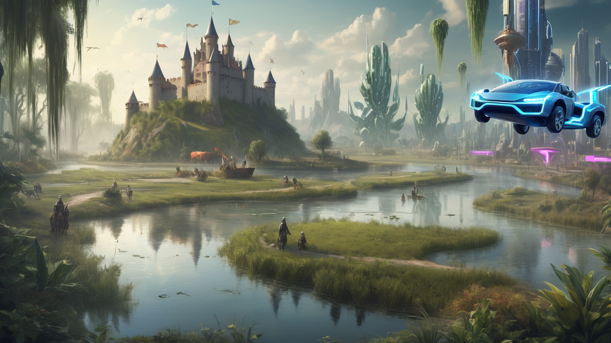</td>
    <td width="50%" style="border: none"></td>
  </tr>
  <tr>
    <td colspan="2" style="border: none; text-align: left; word-wrap: break-word">
      Futuristic and prehistoric worlds collide: Dinosaurs roam near a medieval castle, flying cars and advanced skyscrapers dominate the skyline. A river winds through lush greenery, blending ancient and modern civilizations in a surreal landscape.
    </td>
  </tr>
</table>
</details>

<details open>
<summary>Enhance Omost with IterComp</summary> 
<table class="center" style="width: 100%; border-collapse: collapse;">
  <tr>
    <td width="50%" style="border: none; text-align: center; word-wrap: break-word">Omost</td>
    <td width="50%" style="border: none; text-align: center; word-wrap: break-word">Omost with IterComp</td>
  </tr>
  <tr>
    <td width="50%" style="border: none">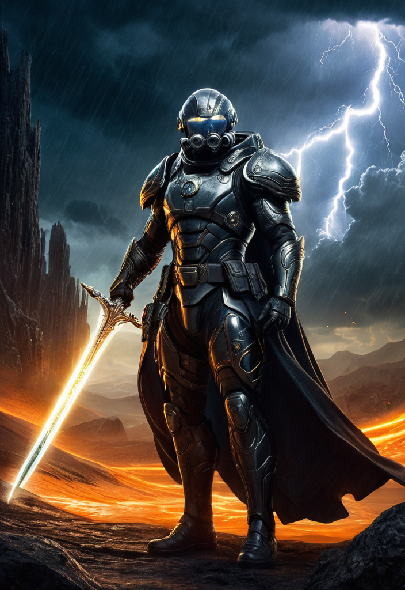</td>
    <td width="50%" style="border: none">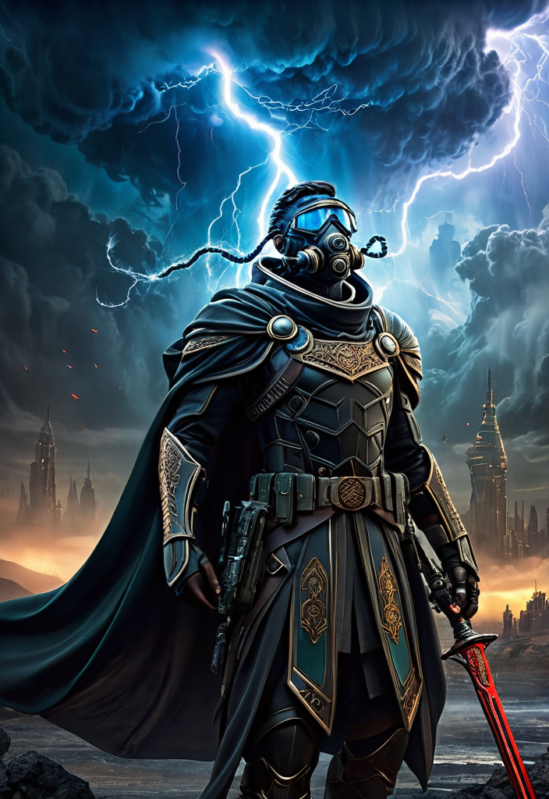</td>
  </tr>
  <tr>
    <td colspan="2" style="border: none; text-align: left; word-wrap: break-word">
      Amidst a stormy, apocalyptic skyline, a masked warrior stands resolute, adorned in intricate armor and a flowing cape. Lightning illuminates the dark clouds behind him, highlighting his steely determination. With a futuristic city in ruins at his back and a red sword in hand, he embodies the fusion of ancient valor and advanced technology, ready to face the chaos ahead.
    </td>
  </tr>
</table>
</details>

## Quick Start for T2I Generation

Our checkpoints are publicly available on [HuggingFace Repo](https://huggingface.co/comin/IterComp). Use the code below to try our IterComp:

```python
from diffusers import DiffusionPipeline
import torch

pipe = DiffusionPipeline.from_pretrained("comin/IterComp", torch_dtype=torch.float16, use_safetensors=True)
pipe.to("cuda")
# if using torch < 2.0
# pipe.enable_xformers_memory_efficient_attention()

prompt = "An astronaut riding a green horse"
image = pipe(prompt=prompt).images[0]
image.save("output.png")
```

## Installation

```shell
git clone https://github.com/YangLing0818/IterComp
cd IterComp
conda create -n IterComp python==3.8.10
conda activate IterComp
pip install -r requirements.txt
```

## Build the Model Gallery

We provide the code of five models to build the model gallery (SD1.5, SDXL, SD3, FLUX-dev, and RPG). To obtain the composition-aware model preference dataset across three key aspects of compositional generation: Attribute Binding (Color, Shape, and Texture), Spatial Relationships, and Non-spatial Relationships, simply run the following command to generate the results:

```bash
python data/model_gallery.py --compositional_metric 'attribute_binding'
```

**--compositional_metric** should in `{'attribute_binding, 'spatial_relationship', 'non_spatial_relationship'}`

We recommend using additional methods that excel in different aspects of compositionality to expand model gallery, such as [InstanceDiffusion](https://github.com/frank-xwang/InstanceDiffusion) and [Omost](https://github.com/lllyasviel/Omost). Please follow their codebases to generate images using the same settings as in our code.

We manually rank the images generated by the models in the model gallery, and the final results are saved in the following format：

```json
{
    "index": 7,
    "prompt": "a blue car and a brown giraffe",
    "image_sd15": "datasets/train/attribute_binding/sd15_prompt_7.png",
    "image_sdxl": "datasets/train/attribute_binding/sdxl_prompt_7.png",
    "image_sd3": "datasets/train/attribute_binding/sd3_prompt_7.png",
    "image_flux": "datasets/train/attribute_binding/flux_prompt_7.png",
    "image_rpg": "datasets/train/attribute_binding/rpg_prompt_7.png",
    "image_instancediffusion": "datasets/train/attribute_binding/instancediffusion_prompt_7.png",
    "rank": [4, 3, 5, 2, 1, 6]
},
```

The i-th element, j, in the rank list indicates that the j-th model in the model gallery is ranked in the i-th position. For example, the rank list `[4, 3, 5, 2, 1, 6]` means that the 4th model in the model gallery, flux, is ranked 1st, the 3rd model, sd3, is ranked 2nd, and so on.

## Composition-Aware Reward Models Training

First, you should pair the images two by two based on the ranking to make the dataset:

```bash
python train/make_dataset.py
```

We provide a script for reward models training:

```bash
bash scripts/train_reward_models.sh
```

For each of the composition-aware reward models, you should follow this process to get the reward model.

## Multi-Reward Feedback Learning

The training dataset for multi-reward feedback learning is in `data/itercomp_train_data.json`, after setting the paths for composition-aware reward models, you can finetune the base diffusion model as follow:

```shell
bash scripts/iterative_fl.sh
```

## Iterative Feedback Learning

After the training of iteration 0, we can start a new iteration of refinement based on the optimized diffusion model. 

In iteration 1, we expand model gallery with Omost and the optimized base diffusion model using:

```bash
python data/iterative_expand_gallery.py
```

The updating model gallery is saved in the following format：

```json
{
    "index": 7,
    "prompt": "a blue car and a brown giraffe",
    "image_sd15": "datasets/train/attribute_binding/sd15_prompt_7.png",
    "image_sdxl": "datasets/train/attribute_binding/sdxl_prompt_7.png",
    "image_sd3": "datasets/train/attribute_binding/sd3_prompt_7.png",
    "image_flux": "datasets/train/attribute_binding/flux_prompt_7.png",
    "image_rpg": "datasets/train/attribute_binding/rpg_prompt_7.png",
    "image_instancediffusion": "datasets/train/attribute_binding/instancediffusion_prompt_7.png",
    "image_sdxl_iteration1": "datasets/train/attribute_binding/sdxl_iteration1_prompt_7.png",
    "image_omost": "datasets/train/attribute_binding/omost_prompt_7.png",
    "initial_rank": [4, 3, 5, 2, 1, 6],
    "rank": [4, 3, 7, 5, 8, 2, 1, 6]
},
```

After updating the composition-aware model preference dataset, you should to train the reward models and base diffusion model according to the process described above.

## Extend IterComp to various models

IterComp can **serve as a powerful backbone for various compositional generation methods**, such as [RPG](https://github.com/YangLing0818/RPG-DiffusionMaster) and [Omost](https://github.com/lllyasviel/Omost). We recommend integrating IterComp into these approaches to achieve more advanced compositional generation results. Simply update the backbone path to [IterComp](https://huggingface.co/comin/IterComp) to apply the changes.

## Citation

```
@article{zhang2024itercomp,
  title={IterComp: Iterative Composition-Aware Feedback Learning from Model Gallery for Text-to-Image Generation},
  author={Zhang, Xinchen and Yang, Ling and Li, Guohao and Cai, Yaqi and Xie, Jiake and  Tang, Yong and Yang, Yujiu and Wang, Mengdi and Cui, Bin},
  journal={arXiv preprint arXiv:2410.07171},
  year={2024}
}
```

## Acknowledgements

Our IterComp is a general text-to-image generation framework, which is builded upon several solid works. Thanks to [ImageReward](https://github.com/THUDM/ImageReward) and [RPG](https://github.com/YangLing0818/RPG-DiffusionMaster/tree/main) for their wonderful work and codebase! 
